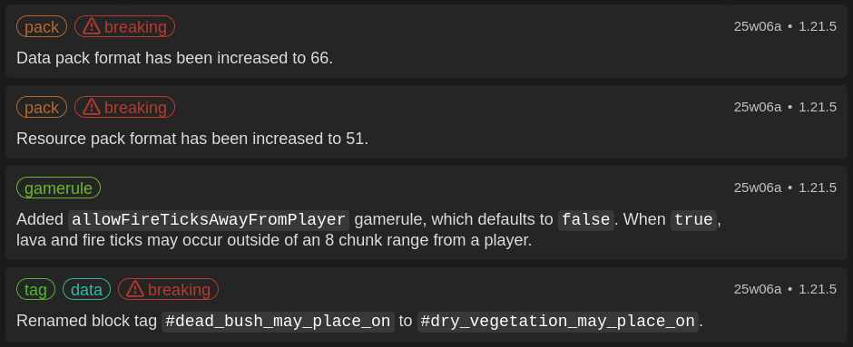
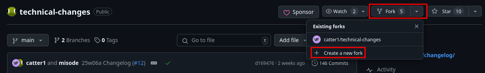
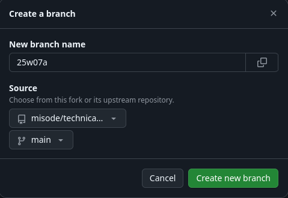
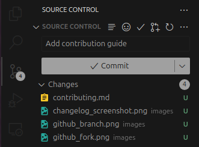
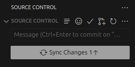
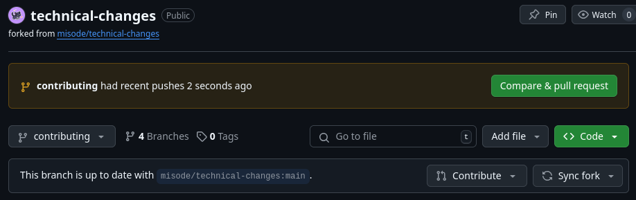
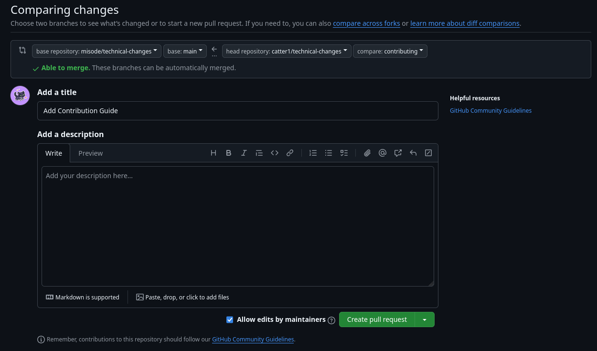

## Table of Contents
- [About](#about)
- [Contributing](#contributing)
- [Github](#github)

# About

This repository is a place to process and tag the Minecraft snapshot changelogs for use on [Misode's Technical Changelogs](https://misode.github.io/changelog/). Each technical change for data packs and resource packs is separated into easy-to-read blurbs, and tagged according to what they affect.

On the website, a user can easily filter through changes by selecting a Minecraft version, or by a tag to see all changes associated with it.



# Contributing

The contribution of changelogs are welcome. It's a lot of work to add the changelogs each week.

## Format
All changelogs are grouped into folders based on the release they will apply to. Each snapshot or pre-release gets its own markdown file, named according to the version. For example, a snapshot could be named `24w45a.md`, and a pre-release `1.21.4-pre2.md`. If a snapshot releases with no technical changes, no file is made for it.

Inside the file, each change is separated by a newline for neatness. Each technical change will begin with tags separated by spaces, and finished by a pipe character (`|`). After the pipe character, the change may be written. Each change must have at least one tag.

```md
pack breaking | Data pack format has been increased to 66.
```

## Tags

A list of all used tags is defined in `tags.json` in the root of this repository. It is important to use the same spelling for each tag, so a user does not miss changes when filtering by one spelling of the tag. Also in the `tags.json` are brief descriptions of each tag for when it should be used. Combinations of multiple tags is encouraged when necessary.

### Special Tags

While most tags are self-explanitory, certain tags have special behavior:

- **Breaking**: This tag is given a special ⚠ symbol next to it. It should be applied to any change that would either cause a behavior change or validation failure when updating a pack from the previous version.
- **Obsolete**: This tag is given a special 🚫 symbol next to it, and hides the entry on the combined release version page. It should be applied to any change that is cancelled, overriden, or made redundant by a change later in the update cycle. The later change that made the original change obsolete should also be tagged as such. This tag is most commonly used for pack format changes.

## Changelog

The technical change should be a brief and simplified version of what is written in the official changelog, typically in 1-2 sentences. The change should be written in a single line, except when bullet points are needed to properly communicate detail for larger changes.

Consistency allows for the changelogs to be easier to read. Here are a few conventions and tips:
- Changes should be written in complete sentences. They should start with a capitalized letter and end with a period, unless it doesn't make sense in bullet points.
- Even if the location of the change is implied in the tags, it should also be specified in the actual change.
```diff
- shader breaking | Removed fields `blend`, `position_color_tex`, `glint_direct`, and `armor_glint`.
+ shader breaking | Changed core shader definitions. Removed fields `blend`, `position_color_tex`, `glint_direct`, and `armor_glint`.
```
- Fields, values, ids, and etc. should be formatted in a single-tick code block.
```md
gamerule | Added `allowFireTicksAwayFromPlayer` gamerule, which defaults to `false`. When `true`, lava and fire ticks may occur outside of an 8 chunk range from a player.
```
- Block, item, and entity names should not be capitalized.
```diff
- nbt entity | The `Owner` field of tamed animals is no longer restricted to referencing Players.
+ nbt entity | The `Owner` field of tamed animals is no longer restricted to referencing players.
```
- The `minecraft:` prefix for registries should be omitted.
```diff
- item component | Tooltips for bucket of tropical fish and painting items are based off of new components instead of `minecraft:bucket_entity_data` and `minecraft:entity_data`.
+ item component | Tooltips for bucket of tropical fish and painting items are based off of new components instead of `bucket_entity_data` and `entity_data`.
```
- When documenting a repeatable change or addition, it is encouraged to reference old changelogs and copy the same formatting. Not only is it more consistent, but it saves time writing.
```md
variant | Cat variants can now be data-driven, with entries in the `cat_variant` folder. The file takes fields `asset_id` and `spawn_conditions`.

variant | Frog variants can now be data-driven, with entries in the `frog_variant` folder. The file takes fields `asset_id` and `spawn_conditions`.
```
- A useful time to use bullet points is to group together very similar changes, even if they are separated in the official changelog.
```md
block data | The following block data fields will no longer stay persistent when removed via `/data` or other data modification methods:
* all applicable: `CustomName` and `LootTable`
* end gateway: `exit_portal`
* furnace, smoker, and blast furnace: `RecipesUsed`
* skull: `note_block_sound`
```
- When the data pack or resource pack version changes, make sure to mark the version change in the previous snapshot's changelog as `obsolete`.

# GitHub

To contribute a changelog, follow the instructions:

1. Create a fork of this repository.


2. Clone your fork locally.
```bash
git clone https://github.com/<username>/technical-changes.git
```

3. Create a new branch on the fork, selecting the `main` branch from the base repository as the source.

Once it's created, run
```bash
git switch <branch_name>
```
Alternatively, you can create and swap to the branch by running:
```bash
git checkout -b <branch_name>
```

4. Create your changelog and push the changes with an appropriate commit message.


Alternatively:
```bash
git add .
git commit -m "<commit message>"
git push -u origin <branch_name>
```

5. On GitHub, create a pull request for the new branch. Click on "Compare & pull request".


6. Write a title for your pull request (likely just the version your changelog targets), then hit "Create pull request".


Now your changes are ready to be reviewed, and eventually merged. Thanks for contributing!